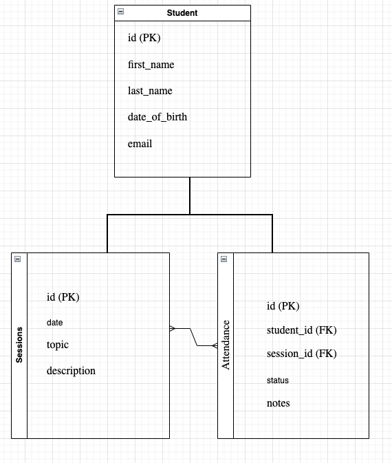

# Summer Program Attendance Tracker

This project is a web application designed to track and log the daily attendance of students in a summer program. The back-end is built with Django, and the front-end is built with React.


## Wire-frame


## ERD


## Features

- Manage student information
- Schedule and manage sessions
- Record and track student attendance
- View attendance records

## Models

### Student
- `first_name`: CharField, max length 50
- `last_name`: CharField, max length 50
- `date_of_birth`: DateField
- `email`: EmailField, unique

### Session
- `date`: DateField, unique
- `topic`: CharField, max length 100
- `description`: TextField

### Attendance
- `student`: ForeignKey to Student
- `session`: ForeignKey to Session
- `status`: CharField, choices: ('Present', 'Absent')
- `notes`: TextField, optional

## Installation

### Back-End (Django)

1. Clone the repository:

    ```bash
    git clone https://github.com/graceCanCod3/attendance-tracker.git
    cd attendance-tracker
    ```

2. Create a virtual environment and activate it:

    ```bash
    Go into project_name
    brew install pipenv
    pipenv shell
    ```

3. Add Packages in Pipfile
    ```bash
    [packages]
    django = "*"
    psycopg2-binary = "*"
    ```

3. Install the dependencies:

    ```bash
    pip install -r requirements.txt
    ```

4. Apply the migrations:

    ```bash
    python manage.py makemigrations
    python manage.py migrate
    ```

5. Create a superuser to access the Django admin:

    ```bash
    python manage.py createsuperuser
    ```

6. Run the development server:

    ```bash
    python manage.py runserver
    ```

7. Open your browser and go to `http://127.0.0.1:8000/admin` to log in and manage the application.

### Front-End (React)

1. Navigate to the `frontend` directory:

    ```bash
    cd frontend
    ```

2. Install the dependencies:

    ```bash
    npm install
    ```

3. Start the React development server:

    ```bash
    npm start
    ```

4. Open your browser and go to `http://localhost:3000` to view the React application.

## Usage

- Add students via the Django admin interface or through the React front-end.
- Schedule sessions by adding new session entries.
- Record attendance for each session by selecting the session and marking each student's status as 'Present' or 'Absent'.
